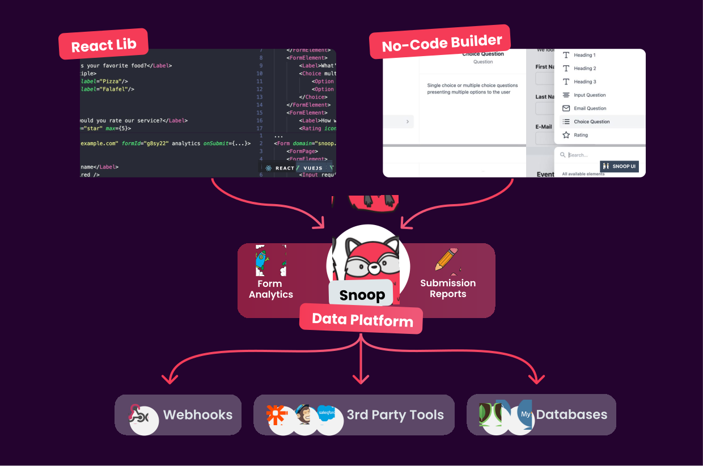

# SnoopForms Platform

Finally build amazing forms in React. With built-in state-management, a lot of pre-built components and analytics, submission management & data pipelines using the snoopForms platform.

Spin up forms in minutes. Pipe your data exactly where you need it. Maximize your results with juicy analytics.

## Features

- Work with the React Lib or use our No Code Builder to build exactly the forms you need.
- Pipe your data where you need it. Don’t wait for your form provider to finally build the integration you desperately need.
- Since you can self-host Snoop Forms, it’s 100% compliant with all privacy regulations.
- How users interact with your form can be as important as their input. Don’t miss anything with our best-in-class analytics.
- We aim for the best possible developer experience. Use what you like, build on top what you need. Everything is possible.
